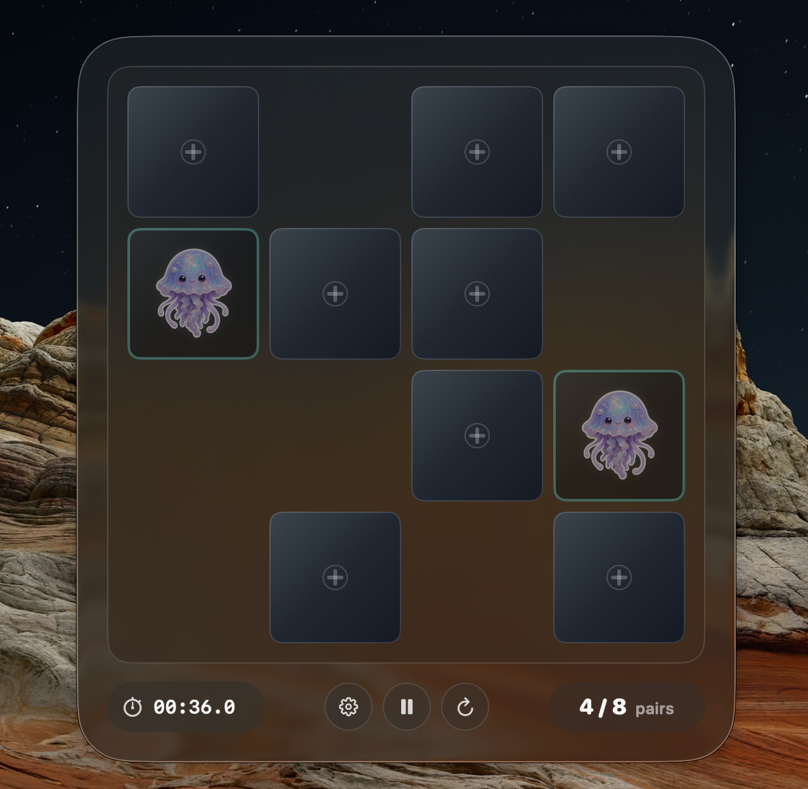
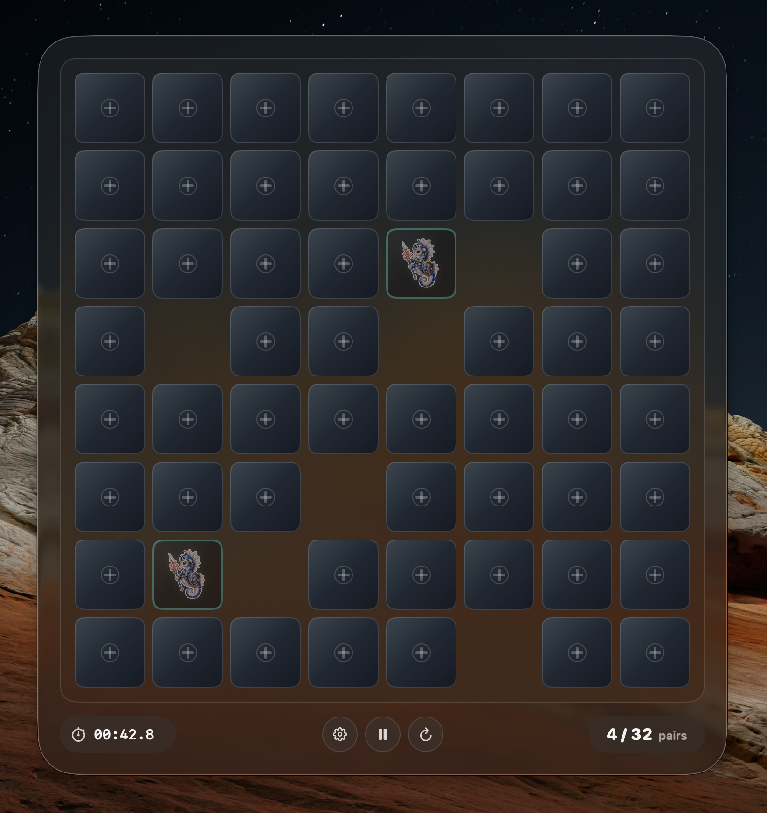

# PeekPairs

PeekPairs is a native macOS memory game built in SwiftUI/AppKit. It is designed for quick hotkey-driven rounds, dark-mode glass UI, animated 3D card flips, automatic focus-loss pause/minimize, persistent local stats, and configurable global shortcuts.

<p align="center">
  
</p>

<p align="center">
  <br>
  <sub>8x8 board example.</sub>
</p>

## Build

```sh
export DEVELOPER_DIR=/Applications/Xcode.app/Contents/Developer
export CLANG_MODULE_CACHE_PATH="$PWD/.build/module-cache"
export SWIFTPM_MODULECACHE_OVERRIDE="$PWD/.build/module-cache"

swift test
scripts/package-app.sh debug
open dist/PeekPairs.app
```

The packaged app is written to `dist/PeekPairs.app`.

## Release App

The current downloadable app archive is tracked at `release/PeekPairs.app.zip` and currently packages PeekPairs `0.1.4`.

To rebuild the release archive and update the local app in `/Applications`:

```sh
scripts/build-release.sh
```

The release script creates `release/PeekPairs.app.zip`, writes `release/PeekPairs.app.zip.sha256`, and installs the current build to `/Applications/PeekPairs.app`. The app is ad-hoc signed for local use; a public Developer ID notarized release would require Apple signing credentials.

## Controls

- Gear button or `Command-,`: settings popup
- Plus button: new round
- Play/pause button: resume or pause the current round
- Settings include default board size, default app window width, global shortcuts, and the focus-loss minimize toggle.
- Default global shortcuts:
  - `Control-Option-Command-M`: open paused board
  - `Control-Option-Command-N`: open and start a new game
  - `Control-Option-Command-P`: resume current game or start one; when PeekPairs is already focused, hide it

Settings and history are saved locally in `~/Library/Application Support/PeekPairs`.

## QA

Set `PEEKPAIRS_SEED=<number>` before launching the app to force deterministic shuffles for repeatable UI verification. Normal launches use fresh random seeds.
